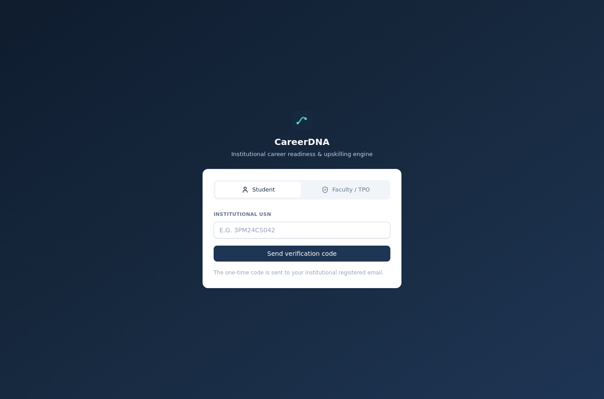
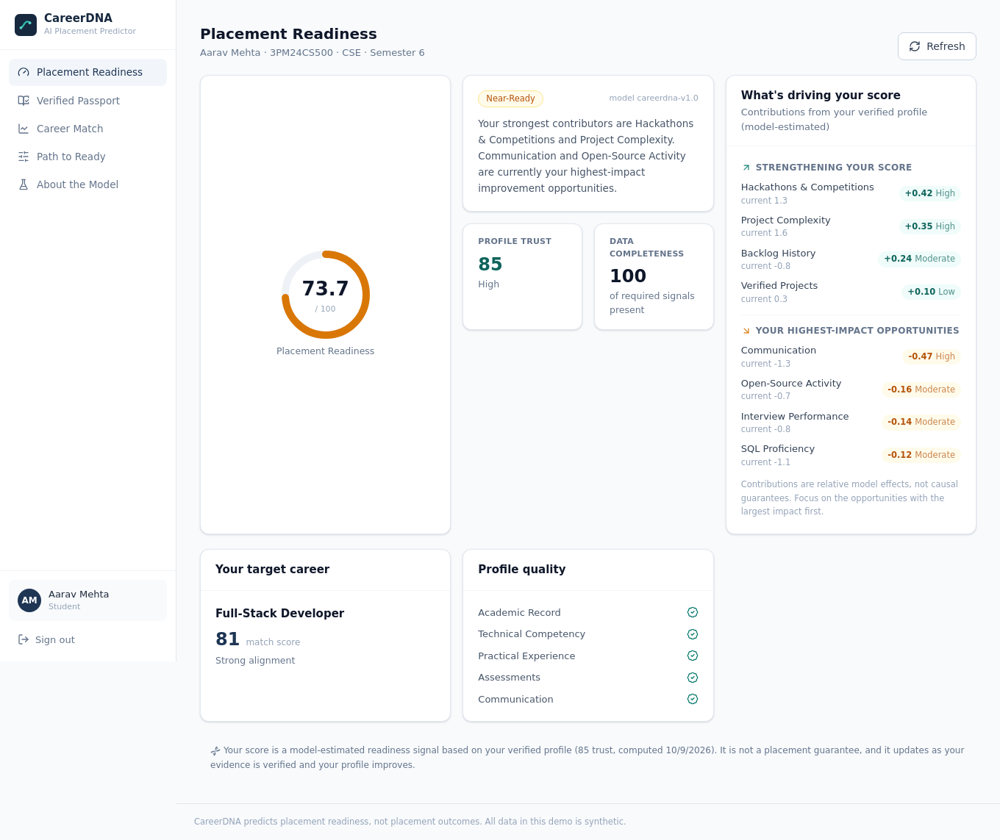
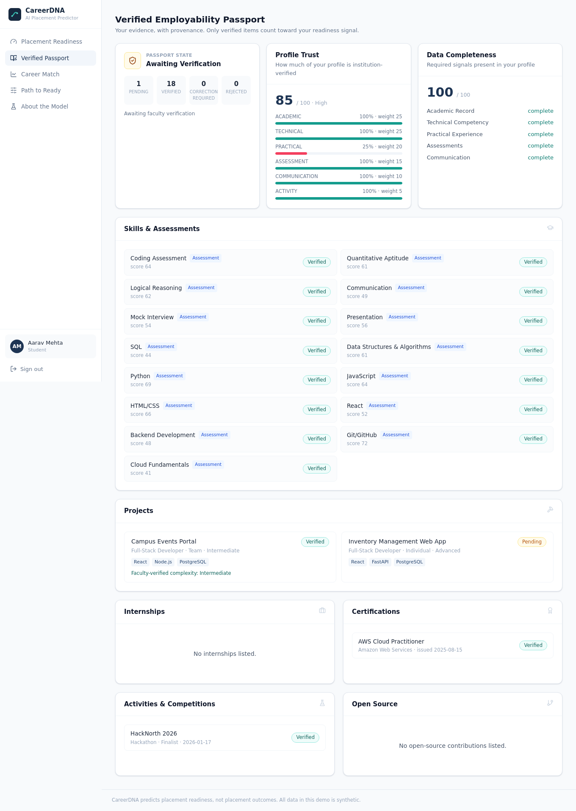
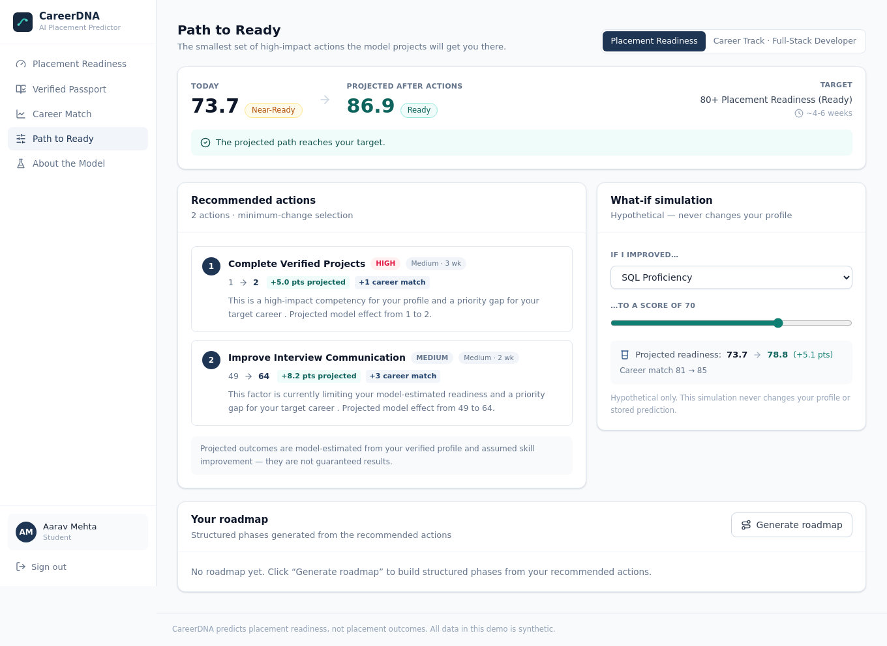
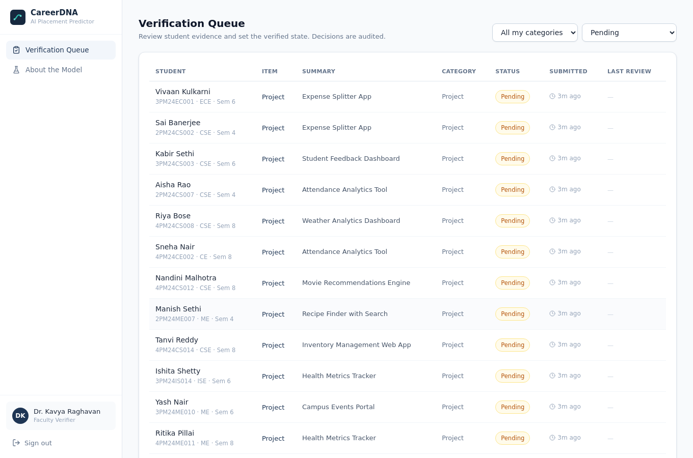
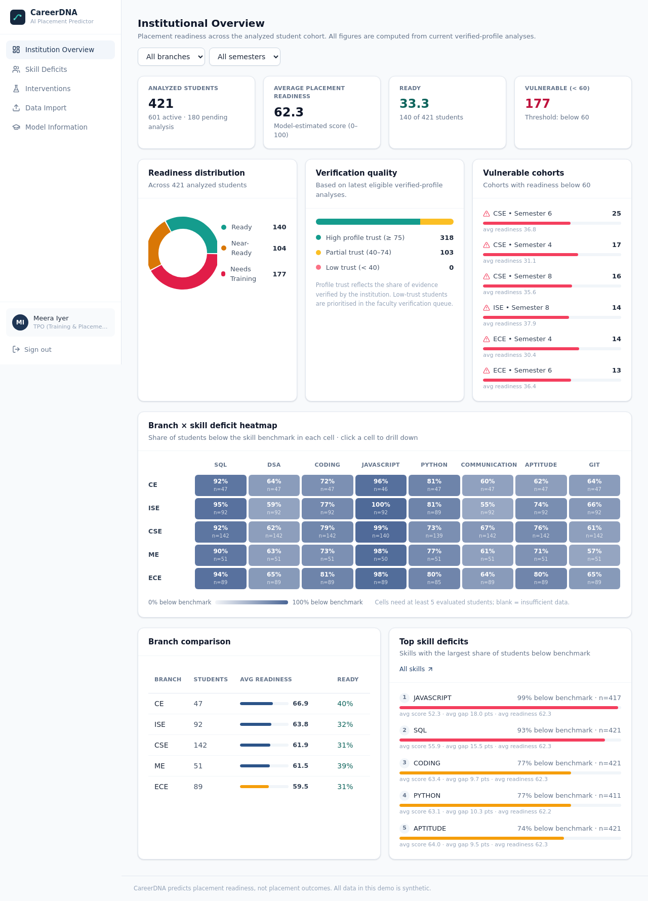
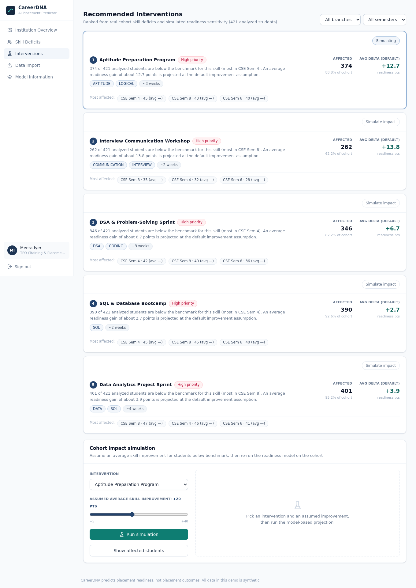

# Demo Script (≈10 minutes)

Goal: show the three roles and the three flagship differentiators, in a story arc that ends
with an institutional decision. Everything below is live data from the synthetic demo roster.

> **Setup:** this script needs the full demo roster:
> `cd backend && .venv/bin/python -m scripts.reset_demo --with-demo`
> (The default reset keeps the institution **empty** for your own CSV import.)

**Accounts**

| Role | Sign-in |
|---|---|
| Student (flagship) | USN `3PM24CS500` → demo OTP `246810` (Aarav Mehta, CSE, Sem 6) |
| Faculty verifier | `kavya.raghavan@northfielddemo.edu` / `FacultyDemo123!` |
| TPO | `meera.iyer@northfielddemo.edu` / `TPOAdmin123!` |

---

## Act 1 — The student sees a *verified* readiness (3 min)

1. Log in as **Aarav** (`3PM24CS500`, OTP `246810`).
   
2. **Placement Readiness** opens: **73.7 — Near-Ready**, model version shown, profile trust 85.
   Point out the *Why this score* panel: the strongest contributors (Hackathons, Project
   Complexity) and the highest-impact opportunities (Communication, Open-Source, Interview).
   These are real model contributions — hover to see the technical feature name.
   
3. **Verified Passport**: the flagship. Note the **PENDING** project ("Inventory Management Web
   App") with its provenance label, vs the VERIFIED project. The unverified item is *excluded*
   from the primary prediction — that's the whole point.
   
4. **Path to Ready** (the Minimum-Change Optimizer): the app proposes the smallest set of
   actionable improvements and shows a **projected** readiness if they happen — clearly labelled
   model-based, and it never writes to the profile. Move the *What-if* slider and watch the
   projection re-run the real model live.
   

> Narrative: "Nothing here is a hardcoded number. Verify the pending project next and watch the
> score and category move."

## Act 2 — Faculty verification moves the number (2 min)

1. Log in as **Dr. Kavya Raghavan** (faculty). The queue is **category-scoped** (she sees
   TECHNICAL_SKILL / PROJECT / CERTIFICATION only).
   
2. Open Aarav's pending project, review the evidence + audit history, **Verify**.
3. Back as Aarav → refresh readiness: **81.0 — Ready**. The verification *caused* a real
   model re-run on a richer verified feature snapshot (verified project count went up).
   This is the loop: institutional verification directly raises placement readiness.

## Act 3 — The TPO turns individuals into institutional action (4 min)

1. Log in as **Meera Iyer** (TPO). **Institutional Overview**: 421 analyzed, readiness
   distribution donut, average 62.3, vulnerable (<60) count, and the **branch × skill deficit
   heatmap** — every cell is a live aggregate with its sample size `n`.
   
2. Click a heatmap cell (e.g. CSE × JAVASCRIPT) → **Skill Deficits** drill-down lists the
   actual students below benchmark, with gap and readiness.
3. **Recommended Interventions**: ranked from *real* cohort deficits. Pick one, set an assumed
   improvement, **Run simulation** → the model re-runs on the cohort and shows baseline →
   projected readiness distribution + how many students move categories, with the
   "model-based projection, not guaranteed outcome" disclaimer.
   
4. **Data Import**: download the CSV template, upload, see the two-phase
   validate → confirm report with per-row errors, then confirm (upsert by USN, fully audited).
5. **Model Information**: real held-out metrics, the candidate comparison, feature importance,
   and the responsible-AI terminology.

> Closing line: "Student gets a verified, explained readiness signal. Faculty's verification is
> what powers it. TPO turns thousands of individual signals into a ranked, simulated,
> institution-wide upskilling plan — all on a real trained model, all local, all free."

## Troubleshooting the demo

- **Reset the story** (Aarav back to Near-Ready with the pending project):
  `cd backend && .venv/bin/python -m scripts.reset_demo` (safe while the API runs).
- **Blank/old screen after a reset**: hard-refresh the browser; the Vite dev server picks up
  data live, no rebuild needed.
- **OTP not shown**: confirm `DEMO_MODE=true` (default) on the backend process.
